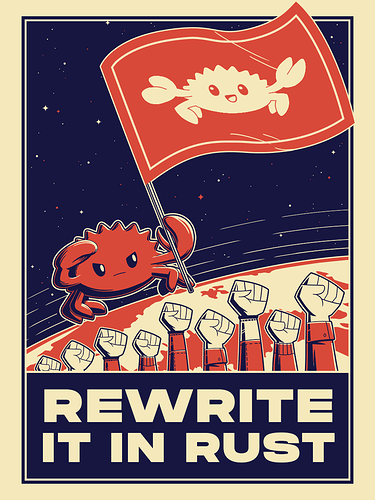

# Boitano Workshop

Velkommen til workshop med EikLab!

I dag skal vi lage en [Temperature Sensor Coaster](https://projecthub.arduino.cc/jensmalmgren/90452a6a-0b24-4c94-8fb2-4dd2b91225d7). I dette repoet finner du filene du trenger for å gjennomføre prosjektet.

## Veien videre

Fikk du mer-smak? Klør det i fingerne etter å kode mer?

Her har vi et par forslag til hva du kan gjøre videre:

1. Lag et GUI program for å konfigurere temperatur coasteren. I koden finner du logikken for hvordan du skriver ut verdiene til Arduiono-en :). For python kan vi anbefale [streamlit](https://streamlit.io/)
2. Rewrite it in rust.  
   
